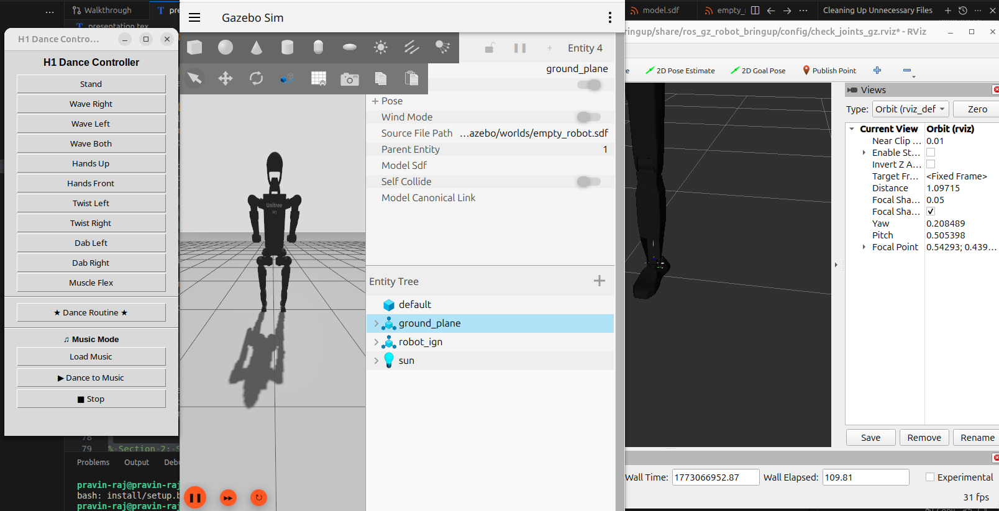
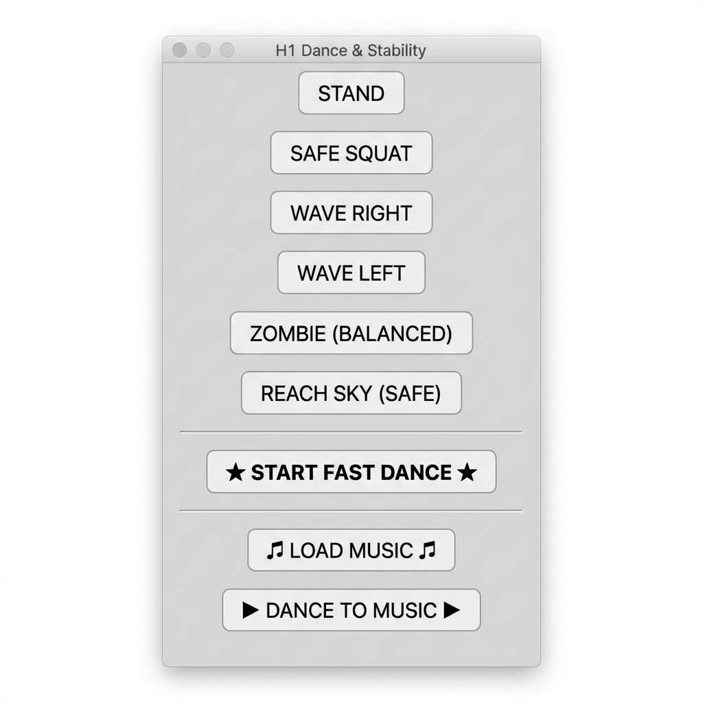
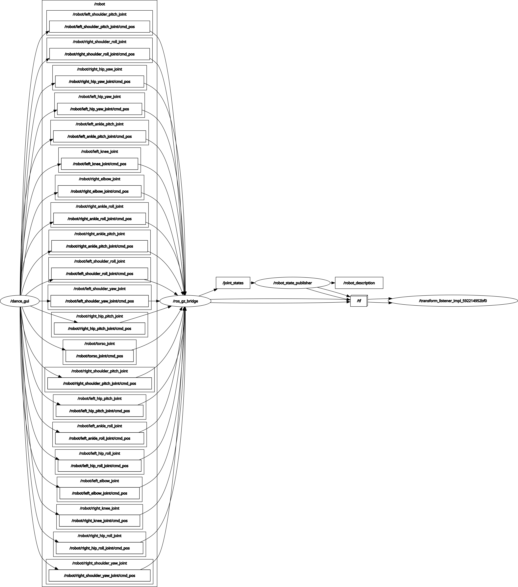
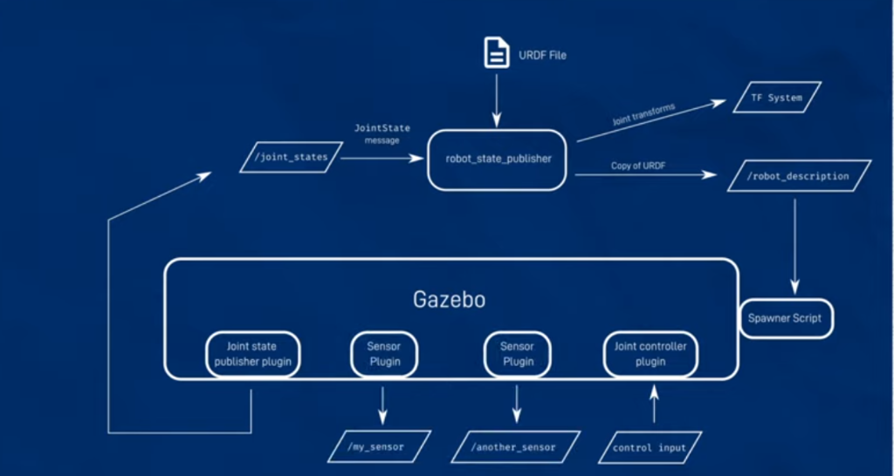

# AI Robot Dance Choreographer using ROS2 and Gazebo

A self-balancing, dancing humanoid robot simulated in Gazebo Harmonic with ROS2 Jazzy. This project features the Unitree H1 humanoid robot, capable of performing synchronized upper-body dance moves to music through an intuitive GUI, while employing kinematic locking on the lower body to ensure flawless stability.

## Key Features

- **Unitree H1 Simulation**: 21 controllable joints simulated in Gazebo Harmonic.
- **Flawless Stability**: Lower-body kinematic locking mechanism ensures the robot never falls during dynamic upper-body moves.
- **Interactive Dance GUI**: A multi-threaded Tkinter-based interface to perform 12 unique dance moves and combinations.
- **Music Synchronization**: Built-in beat detection using `librosa` and playback via `pygame` to make the robot dance to the rhythm.

## Media



## System Architecture

The project is split into two main components: the simulation layer (`gazebo_sim` packages) and the application layer (`robot_dance` package). 

### ROS2 Packages
- **`ros_gz_robot_description`**: URDF/SDF models and mesh files.
- **`ros_gz_robot_gazebo` & `ros_gz_robot_controller`**: World files and joint controllers.
- **`ros_gz_robot_bringup`**: Launch files for Gazebo and ROS2 controllers.
- **`robot_dance`**: Main application node containing the GUI and music synchronization logic.

### Topic Graph


### Workflow


## Installation & Setup

### Prerequisites
- Ubuntu 24.04
- ROS2 Jazzy
- Gazebo Harmonic
- Python 3.12 

### Python Dependencies
```bash
pip install librosa pygame
```

### Build instructions
1. Clone the repository into a ROS2 workspace:
```bash
mkdir -p ~/ros2_ws/src
cd ~/ros2_ws/src
git clone git@github.com:Pravin-raj-03/Ai-robot-dance-choreographer-using-ROS2-and-Gazebo.git
```

2. Build the workspace:
```bash
cd ~/ros2_ws
colcon build --symlink-install
```

## How to Run

1. **Start the Gazebo Simulation:**
```bash
source /opt/ros/jazzy/setup.bash
source install/setup.bash
ros2 launch ros_gz_robot_bringup gazebo_sim.launch.py
```

2. **Start the Dance GUI (In a new terminal):**
```bash
source /opt/ros/jazzy/setup.bash
source install/setup.bash
ros2 run robot_dance dance_gui
```

## Stability Strategy
To prevent the humanoid from falling over during dynamic upper-body movements, a continuous control loop runs at 50Hz, publishing fixed `0.0` values to all lower-body joints (hips, knees, ankles). This acts as a rigid anchor, allowing complex arm and torso choreographies without complex dynamic balancing algorithms.

## Acknowledgements
Developed by Pravin Raj.
